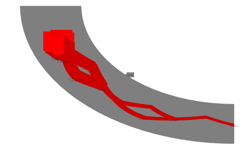
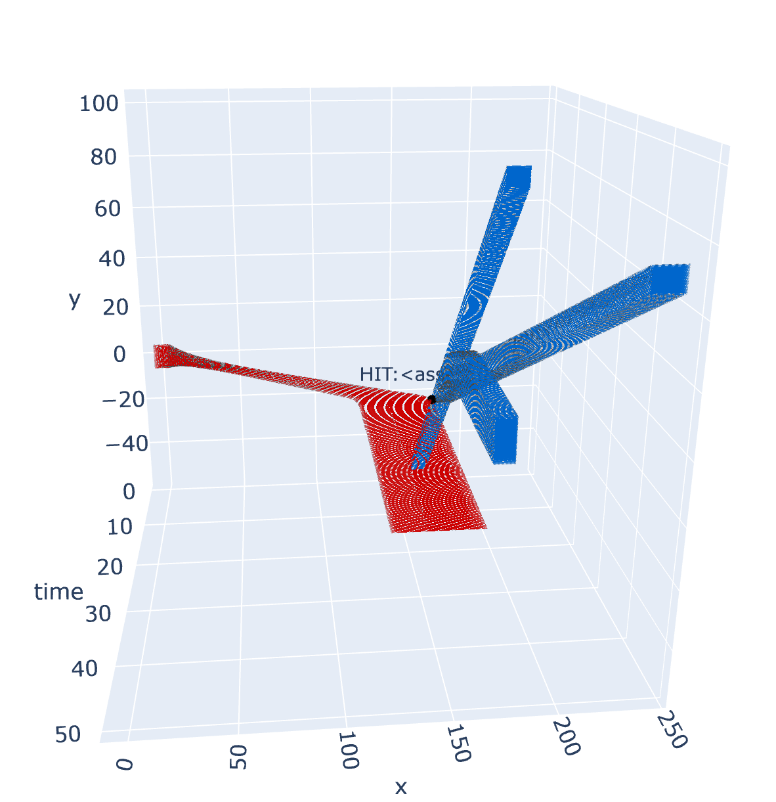
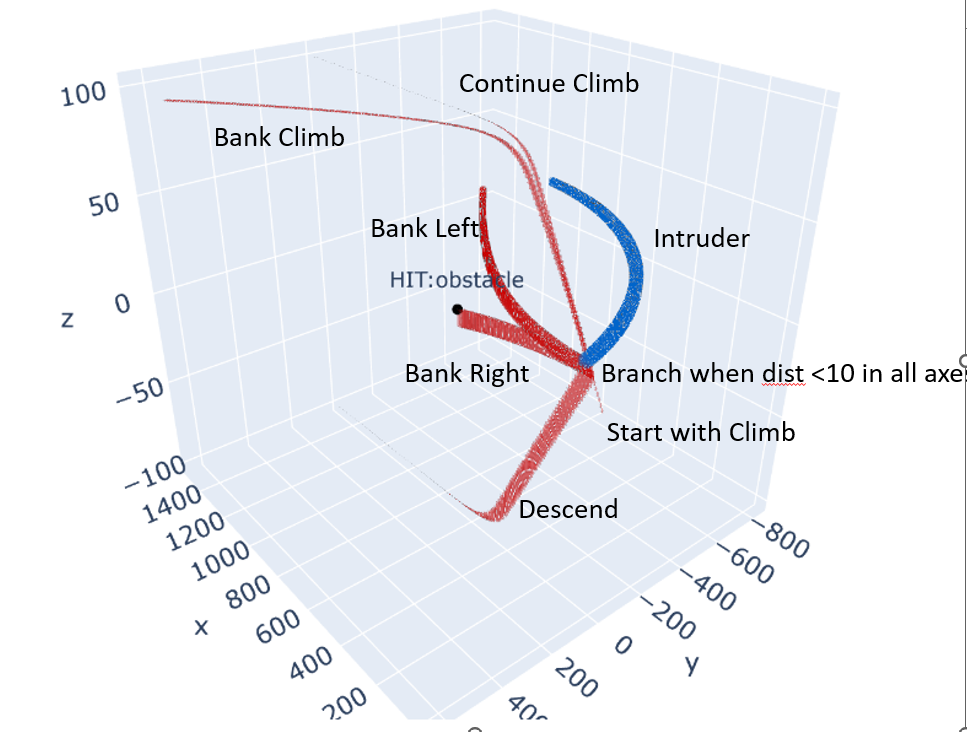

# Verse Library

Verse is a Python library for creating, simulating, and verifying scenarios with interacting, decision making agents. The decision logic of an agent can be written in an expressive subset of Python. The continuous evolution can be described as a black-box function. The agent can be ported across different maps, which can be defined from scratch or imported from [opendrive](https://www.opendrive.com/) files. Verse scenarios can be simulated and verified using hybrid reachability analysis algorithms. The initial implementation of reachability analysis used intervals (hyperrectangles) as the main data structure. A new implementation that support generalized star sets will soon become available. Verse is developed and maintained by the [Reliable Autonomy Research Group](https://mitras.ece.illinois.edu/group.html) at the [University of Illinois at Urbana-Champaign](https://ece.illinois.edu/).

  

## Installation
The package requires python 3.8+. The package can be installed using pip with all required dependencies

```sh
pip install -e .
```
To update the dependencies in case anything is missing, requirements.txt can be used.

```sh
pip install -r requirements.txt
```
Try
```sh
python3 demo/ball/ball_bounces.py
```
Try other examples in the `demo/` folder. 

## Tutorial

Interactive Jupyter tutorial: [`tutorial/tutorial.ipynb`](tutorial/tutorial.ipynb).

PDF tutorial: [`tutorial.pdf`](tutorial/tutorial.pdf).

Documentation (in progress): [Online](https://autoverse-ai.github.io/Verse-library/). 

Read comments in `demo/ball/ball_bounces.py` and other examples in the demo folder to learn how to create new agents and scenarios.


## Using NeuReach with Verse
Verse allows users to plug-in different backend tools for computing reachable sets, specifically, the continuous-post operator. By default, Verse supports [DryVR](https://mitras.ece.illinois.edu/research/2017/DryVRpaper.pdf) and [NeuReach](https://mitras.ece.illinois.edu/research/2022/nureac22TACAS.pdf). For NeuReach, additional dependencies can be downloaded:
```sh
git submodule init
git submodule update
```

## Library structure

The source code of the package is contained in the verse folder, which contains the following sub-directories.

- **verse** Building blocks for creating and analyzing scenarios.

  - **verse/scenario** Scenario base class. A scenario is constructed by several **agents** with continuous dynamics and controller, a **map** and a **sensor** defining how different agents interact with each other.
  - **verse/agents** Agent base class in the scenario.
  - **verse/map** Map base class and corresponding utilities in the scenario.
  - **verse/code_parser** Verse parser for converting the agent's decision logic (transitions)  to ASTs.
  - **verse/automaton** Implements construction of hybrid automaton
  - **verse/analysis** **Simulator** and **Verifier** and related utilities for  analysis of the scenario
  - **verse/dryvr** dryvr for computing reachable sets


- **example** contains example map, sensor and agents that we provided


- **plotter** contains code for visualizing the computed results

# Core Dev Team

- Katherine Braught
- Yangge Li
- Sayan Mitra
- Alex Yuan
- Haoqing Zhu

# Contributors
- Nitish Bhupathi Raju 
- Keyi Shen
- Louis Sungwoo Cho
- Daniel Zhuang


In order to contribute to this repository, you should run the following commands:
```sh
pip install -r requirements-dev.txt
pre-commit install
```

# Related Publications

<b> [Verse: A Python library for reasoning about multi-agent hybrid system scenarios](https://link.springer.com/chapter/10.1007/978-3-031-37706-8_18)</b> [arxiv](https://arxiv.org/abs/2301.08714) 
Yangge Li, Haoqing Zhu, Katherine Braught, Keyi Shen, Sayan Mitra.
In the proceedings of <i>Computer Aided Verification (CAV),</i> LNCS vol 13964, pages 351–364, 2023.

<b> [Verification of L1 Adaptive Control using Verse Library: A Case Study of Quadrotors](https://arxiv.org/abs/2303.13819) </b>
Lin Song, Yangge Li, Sheng Cheng, Pan Zhao, Sayan Mitra, Naira Hovakimyan
In the <i>Work in Progress Session of International Conference on Cyber-Physical Systems (WiP-ICCPS),</i> San Antonio, Tx, 2023.

<b> [Parallel and incremental verification of hybrid automata with Ray and Verse](https://link.springer.com/chapter/10.1007/978-3-031-45329-8_5)</b>
Haoqing Zhu, Yangge Li, Keyi Shen, and Sayan Mitra.
In the proceedings of  21st Intl. <i>Symposium on Automated Technologies for Verification and Analysis (ATVA)</i>, 2023.

<b> [Parallelization and incremental algorithms in the verse hybrid system verification library](https://www.ideals.illinois.edu/items/127392)</b>
Haoqing Zhu, Masters thesis, University of Illinois at Urbana-Champaign, May 2023.

# Sponsors
- [NASA ULI Aviate](https://aviate.illinois.edu/event/nasa-uli-annual-review/)

