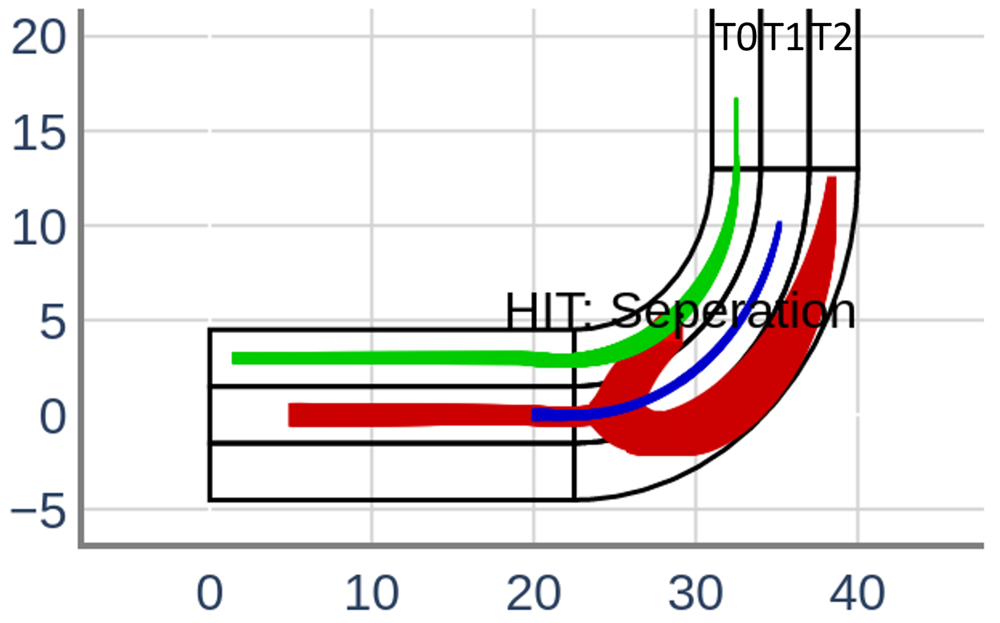

This is the repeatability evaluation package for the tool paper "Verse: A Python library for reasoning about multi-agent hybrid system scenarios". <code>README.txt</code> contains the instruction to reproduce all experiments in the paper. A PDF version of the file can be found at <code>README.pdf</code>. 

# Artifact Link

The link to the artifact on Figshare is:

https://figshare.com/articles/software/Verse_A_Python_library_for_reasoning_about_multi-agent_hybrid_system_scenarios/21433125

The link to the artifact on Google drive is: 

https://drive.google.com/file/d/1MXVTnsqtt1YVOaWZDcgy_gvuC7d_hH7F/view?usp=sharing

The link to the source code git repository for Verse is: 

https://github.com/AutoVerse-ai/Verse-library

A tutorial for creating custom scenarios can be found at:

https://github.com/AutoVerse-ai/Verse-library/tree/tutorial

# Estimated Runtime

The run-time for regenerating data in Table 1 in the paper is approximately 2650s (~44min).

The run-time for regenerating data in Simulation section of Table 2 in the paper is approximately 174s (~3min).

The run-time for regenerating data in Reach section of Table 2 in the paper is approximately 4682s (~78min).

# Installation Instructions

The first step for replicating the experiments in the paper is to install Verse and its dependencies. 

The dependencies for Verse can be installed using following command in the root directory of artifact
```
    python3 -m pip install -r requirements_local.txt
```
Verse can be installed using following command in the root directory of artifact
```
    python3 -m pip install -e .
```

# Experiment Replication Instructions
To replicate our experiments from the paper, please run following commands from the root directory of the artifact. 
1. For results in Table 1 Run command 
    ```
        python3 exprs.py 
    ```
    The results for all experiments in Table 1 will be generated as below at the end of execution. 
    ```
        2 & Q & M6 & DryVR & No & 8 & 53.82\\
        2 & Q & M5 & DryVR & No & 5 & 17.76\\
        2 & Q & M5 & NeuReach & No & 5 & 475.47\\
        3 & Q & M5 & DryVR & No & 7 & 38.26\\
        7 & C & M2 & DryVR & No & 37 & 343.26\\
        3 & C & M1 & DryVR & No & 5 & 22.51\\
        3 & C & M3 & DryVR & No & 4 & 34.12\\
        3 & C & M4 & DryVR & No & 7 & 116.65\\
        3 & C & M1 & DryVR & Yes & 5 & 29.84\\
        2 & C & M1 & DryVR & No & 5 & 14.66\\
        2 & C & M1 & NeuReach & No & 5 & 585.19\\
    ```

2. For results in Table 2,
   
    <strong>Simulation</strong>: Run command 
    ```
        python3 inc-expr.py s
    ```

    The results for the experiments in Table 2 section Simulation will be generated as below at the end of execution

    ```
        & repeat & 45 & 16.92 & 430 & 1.05 & 438 & 3.83 & 83.33 \\
        & change init & 24 & 14.93 & 431 & 12.98 & 436 & 4.07 & 75.91 \\
        & change ctlr & 45 & 16.1 & 431 & 8.49 & 438 & 4.38 & 78.19 \\
    ```

    <strong>Reach</strong>: Run command 
    ```
        python3 inc-expr.py v 
    ```
    The results for the experiments in Table 2 section Verification will be generated as below at the end of execution
    ```
        & repeat & 105 & 464.77 & 498 & 58.99 & 482 & 3.23 & 76.79 \\
        & change init & 49 & 384.84 & 486 & 362.25 & 500 & 3.7 & 73.21 \\
        & change ctlr & 93 & 428.83 & 498 & 227.49 & 491 & 4.0 & 73.44 \\
    ```

3. To reproduce Fig. 1,
    
    <strong>Center</strong>: Run command 
    ```
        python3 demo/tacas2023/exp1/exp1_sim.py p 
    ```
    Verse will automatically open a browser window to show the resulting plot as below.

    


    <strong>Right</strong>: Run command 
    ```
        python3 demo/tacas2023/exp1/exp1.py p
    ```
    

4. To reproduce Fig. 4, from left to right 
   
    <strong>(1)</strong> Run command 
    ```
        python3 python3 demo/tacas2023/exp9/exp9_dryvr.py pl
    ```
    The result will looks like below.
    

    <strong>(2)-(3)</strong> Run command 
    ```
        python3 demo/tacas2023/exp9/exp9_dryvr.py pc
    ```
    Verse will automatically open two browser windows to show the two resulting plots as below. Note that the yellow boxes in the figures are drawn separately. 
    

    

    <strong>(4)</strong> Run command 
    ```
        python3 demo/tacas2023/exp10/exp10_dryvr.py p 
    ```
    The result will looks like below.
    
    
5. To reproduce Fig. 6, 

    <strong>Left</strong>: Run command 
    ```
        python3 demo/tacas2023/exp2/exp2_straight.py p 
    ```
    Verse will automatically open a browser window to show the resulting plot as below. 
    

    <strong>Center</strong>: Run command 
    ```
        python3 demo/tacas2023/exp2/exp2_curve.py p 
    ```
    Verse will automatically open a browser window to show the resulting plot as below. 
    
    
    <strong>Right</strong>: Run command 
    ```
        python3 demo/tacas2023/exp4/exp4.py p
    ```
    Verse will automatically open a browser window to show the resulting plot as below. 
    

6. To reproduce Fig. 8 in Appendix, run command 
    ```
        python3 demo/tacas2023/exp5/exp5.py p
    ```
    Verse will automatically open a browser window to show the resulting plot. The right figure is a zoom in of the left figure as shown below. 
    

7. To reproduce Fig. 9 in Appendix, 
    
    <strong>Left</strong>: Run command  
    ```
        python3 demo/tacas2023/exp6/exp6_neureach.py p
    ```
    Verse will automatically open a browser window to show the resulting plot as shown below. Note that due to the randomization in NeuReach's algorithm, the generated figure can be slightly different from the one included in the paper.
        

    <strong>Right</strong>: Run command 
    ```
        python3 demo/tacas2023/exp6/exp6_dryvr.py p 
    ```
    Verse will automatically open a browser window to show the resulting plot as shown below. 
        

8. To reproduce Fig. 10 in Appendix, run command  
    ```
        python3 demo/tacas2023/exp7/exp7.py p
    ```
    Verse will automatically open two browser windows to show the plots as shown below.
        

        

9. To reproduce Fig. 11 in Appendix, run command 
    ```
        python3 demo/tacas2023/exp3/exp3.py p
    ```
    Verse will automatically open a browser window to show the resulting plot as shown below. 
        

10. To reproduce Fig. 12 in Appendix 
    <strong>Left</strong>: Run command 
    ```
        python3 demo/tacas2023/exp11/inc-expr.py sbp
    ```
    Verse will automatically open a browser window to show the resulting plot. as shown below 
        

    <strong>Right</strong>: Run command 
    ```
        python3 demo/tacas2023/exp11/inc-expr.py vbp
    ```
    Verse will automatically open a browser window to show the resulting plot as below. 
        

11. To reproduce Fig. 15 in Appendix 
    <strong>Left</strong>: Run command 
    ```
        python3 demo/tacas2023/exp11/inc-expr.py snp
    ```
    Verse will automatically open a browser window to show the resulting plot as below. Note that the red box in the figure is added seperately.
        

    <strong>Right</strong>: Run command 
    ```
        python3 demo/tacas2023/exp11/inc-expr.py vnp
    ```
    Verse will automatically open a browser window to show the resulting plot as below. Note that the red box in the figure is added seperately.
        

12. To reproduce Fig. 16 in Appendix 
    <strong>Left</strong>: Run command 
    ```
        python3 demo/tacas2023/exp11/inc-expr.py s8p
    ```
    Verse will automatically open a browser window to show the resulting plot as below. Note that the red box in the figure is added seperately.
        

    <strong>Right</strong>: Run command 
    ```
        python3 demo/tacas2023/exp11/inc-expr.py v8p
    ```
    Verse will automatically open a browser window to show the resulting plot as below. Note that the red box in the figure is added seperately.
        
