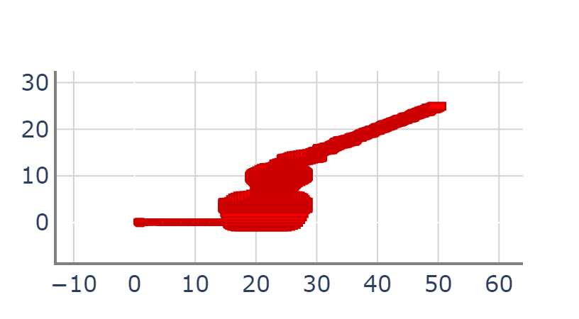
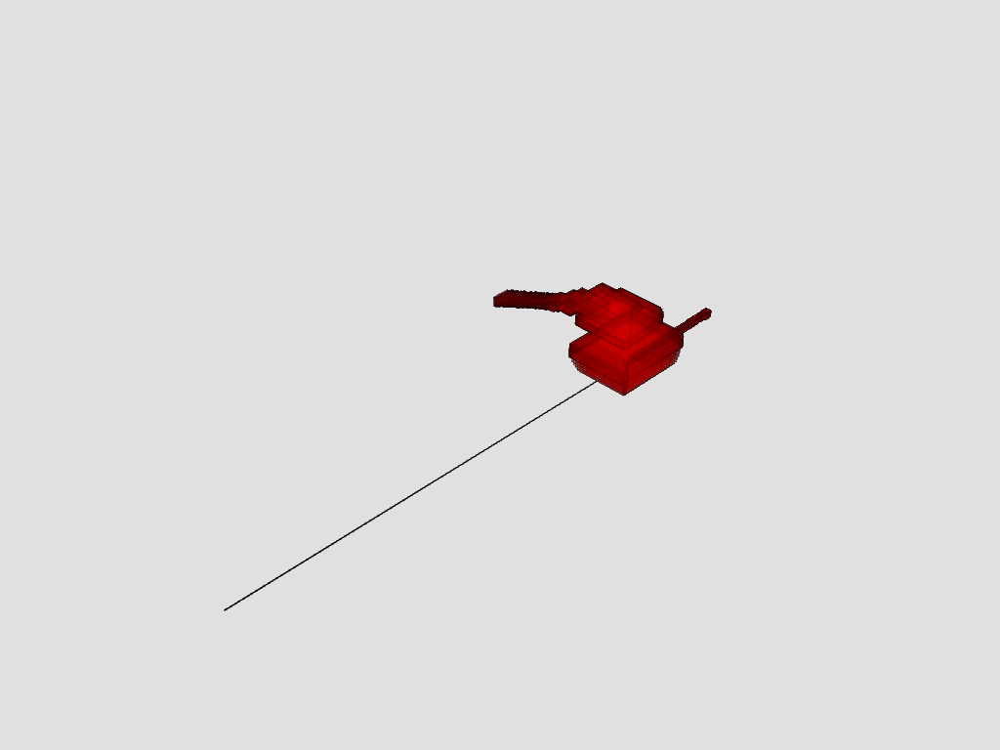

# A First Look at Verse

This is an introduction to creating scenarios in Verse. An interactive tutorial with more details are in [this Jupyter notebook](https://github.com/AutoVerse-ai/Verse-library/blob/main/tutorial/tutorial.ipynb).

A Verse *scenario* is defined by a *map*, a set of *agents*, and optionally  a *sensor*. We will create a  scenario with a drone following a straight path that dodges obstacles by moving up or down.

## Import a map
A *map* specifies the *tracks* or paths that the agents *is allowed to follow*. Our map will have two kinds of tracks: 

    1. T0 is an x-axis aligned track 
    2. TAvoidUp is a upward track for avoiding obstacles on the x-axis. 

<code>T0</code> and <code>TAvoidUp</code> are called the *track modes* in  Verse. To create new maps of your own, see {doc}`Map<map>`. For now, import a pre-defined map with:

```python
from tutorial_map import M3

map1 = M3()
```

> ####  **Note**
> Set <code>PYTHONPATH</code> if necessary to include the Verse directory. For example:
> ```shell
> export PYTHONPATH=../../Verse-library
>```

## Create an agent
An *agent* is defined by:

1. Set of *tactical modes* which define the kinds of behavior the agent *wants to* perform. Tactical and track modes together define the discrete *modes* of the agent. 
2. Set of *state variables* that define the continuous state of the agent in the map or the physical world, as well as the discrete modes.
3. *Decision logic* which define mode changes. 
4. *Flow function* which defines continuous variable changes. 

In our scenario, the tactical modes will be <code>Cruise</code> and <code>Up</code>. The decision logic also need to know the available track modes from the map. The tactical modes and track modes are provided as <code>Enums</code> to Verse.

```python
from enum import Enum, auto


class CraftMode(Enum):
    Cruise = auto()
    Up = auto()


class TrackMode(Enum):
    T0 = auto()
    TAvoidUp = auto()
```

Define the state variables in the <code>State</code> class. You can name your variables however you like. Variables names ending with <code>_mode</code> will be identified as  discrete variables. Here <code>craft_mode</code> and <code>track_mode</code> are the discrete variables and the types are necessary to associate them with the  tactical and track modes.

```python
class State:
    x: float
    y: float
    z: float
    vx: float
    vy: float
    vz: float
    craft_mode: CraftMode
    track_mode: TrackMode
```

The *decision logic (DL)* is a function that takes as input the agent's current state (and optionally the observable states of the other agents) and returns the new state after a transition. That is, it  updates the tactical mode of the agent. The drone starts in <code>Cruise</code> mode and the obstacle is at 20 meters. When the x position of the drone is close 20, the decision logic switches to <code>Up</code>. 

```python
import copy

def decisionLogic(ego: State, track_map):
    next = copy.deepcopy(ego)
    if ego.craft_mode == CraftMode.Normal:
        if ego.x > 20:
            next.craft_mode = CraftMode.Up
            next.track_mode = track_map.map2track(ego.track_mode, ego.craft_mode, CraftMode.Up)
    return next
```

What's <code>track_map.map2track</code>, you might wonder. Recall, tracks are defined by the map, and when the agent decides to change its behavior, say to move up, then the actual path it can follow is given by the map and this is computed using the <code>track_map.map2track</code>. 

> ####  **Note**
> See Verse {doc}`parser<parser>` documentation for allowed syntax in DL. Verse interprets <code>if-then-else</code> conditions nondeterministically. That is, if multiple <code>if</code> conditions are satisfied then *all* the corresponding transitions are simulated.
Save DL code in a file, say <code>dl_sec1.py</code>. 

## Create a scenario

In a separate scenario file, write the the following to instantiate a drone agent. <code>DroneAgent</code> is a Verse class derived from <code>BasicAgent</code>. It defines the continuous dynamics of a quadrotor in 3D-space controller by a neural network (NN). The parameters of this NN are passed to the model using the last two arguments.

```python
from verse.scenario import Scenario
from tutorial_agent import DroneAgent

drone1 = DroneAgent("drone1", file_name="dl_sec1.py",
    t_v_pair=(1, 1), box_side=[0.4] * 3)
drone1.set_initial([[0, -0.5, -0.5, 0, 0, 0], [1, 0.5, 0.5, 0, 0, 0]],
    (CraftMode.Cruise, TrackMode.T0))
scenario = Scenario()
scenario.add_agent(drone1)
scenario.set_map(map1)
```

This sets the initial continuous state of the agent in a rectangle defined by lower-left and the upper-right corners of a 6-dimensional cube, and the discrete state (mode) to be constants. It create an black scenario and then adds the <code>drone1</code> agent to it and the sets the map. Since we only have one agent in the scenario, we don't need to specify a sensor. This completes the definition of the scenario. When executed, Verse will internally construct a hybrid automaton with the state space defined by <code>States</code>, transitions defined by DL and trajectories defined by the <code>DroneAgent</code>.

## Run scenario

Compute simulation traces or reachable states for the scenario
```python
traces_simu = scenario.simulate(60, 0.2)
traces_veri = scenario.verify(60, 0.2)
```

The <code>scenario.simulate(T,d)</code> function computes the simulation tree, with all possible nondeterministic transitions, of maximum duration T with a sampling period of d. The <code>scenario.verify(T,d)</code> function computes the  reachability tree up to time T with a sampling period of d. 


The computed results can be visualized in a number of different ways using Verse's plotting function. 

```python
from verse.plotter.plotter3D import *
import pyvista as pv
import warnings

warnings.filterwarnings("ignore")
from verse.plotter.plotter2D import *
import plotly.graph_objects as go

fig = go.Figure()
fig = reachtube_tree(traces_veri, None, fig, 1, 3)
fig.show()

fig = pv.Plotter()
fig = plot3dMap(map1, ax=fig)
fig = plot3dReachtube(traces_veri, "drone1", 1, 2, 3, color="r", ax=fig)
fig.set_background("#e0e0e0")
fig.show()
```

The visualized reachable set result looks like this:

z vs t plot             |  x,y,z plot
:-------------------------:|:-------------------------:
     |  