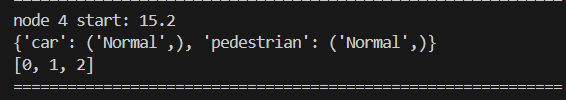
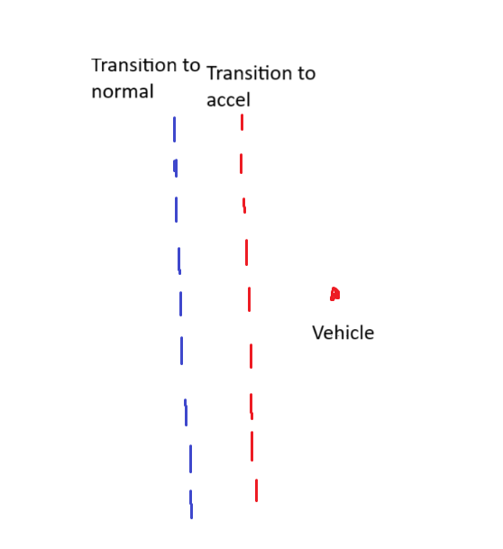
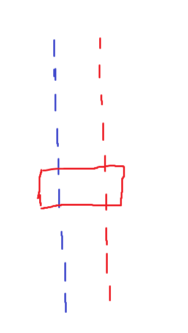

# Troubleshooting Verse

This is a guide to troubleshooting the most common issues in using Verse.


## Unsuported Operations

Even though the decision logic for mode transitions is written in Python, it is not run in the traditional sense. Verse takes the decision logic and parses it for analysis.

Verse's parser only supports the following:
- if statements
- arithmetic operators (+,-,/,*)
- logical operators (and, or , not)
- comparison operators (<=, <, ==, ! =, >, >=)
- functions
- assertions (for defining safety)
- "any" function
- "all" function


This means that the following are *not* supported in reachability (don't even try it):
- print statements
- numpy functions
- loops (except any and all statements)


It is also highly recommended not to use else/elif statements.

If something is not supported, the parser will usually throw a "Not Supported" error message.

Since simulate_simple bypasses the parser, it may be able to handle code unsuported by the parser. 

In terms of formatting, you may nest if statements as follows:

```python

if ego.craft_mode == CraftMode.Normal:
    if .... :
        next.craft_mode == ....
    if ....:
        next.craft_mode ==....


```
## Interpreting the Console Output

Remember that Verse builds a tree of nodes everytime a mode transition needs to happen.

Whenever a transition is evaluated, a console message will appear.



The node number is the id of the node in order of when it was first added to the processing queue.

The "start:" indicates the time that this transition occured. If this number is not changing, then an infinite loop has occured. 

On the next line, it will display each agent and the mode of that agent after the transition. If an infinite loop occurs, you can look at this line to see which modes are being looped through.

Ignore the array of numbers


## Resolving Infinite Loops

**At each timestep, each if statement will be checked. All if conditions marked as true will be evaluated.**

Take this decision logic snippet:

```python

if ego.craft_mode == CraftMode.Normal:
    next.craft_mode == CraftMode.Up

if ego.craft_mode == CraftMode.Normal:
    next.craft_mode == CraftMode.Down

```
We can see that the transition condition is the exact same in both if statements. In this case, both the "up" and "down" branches will both be ran by Verse.

<br/><br/>
Now take, for example, this logic:

```python

if ego.craft_mode == CraftMode.Normal:
    next.craft_mode == CraftMode.Up

if ego.craft_mode == CraftMode.Up:
    next.craft_mode == CraftMode.Normal

```


In this example, we can clearly see a cycle. Think about how the program will run timestep by timestep. When the craft mode is "Normal", it will transition to "Up" due to the 1st if statement. Then in the next timestep, the craft will transition to "Normal" due to the 2nd if condition. In the next timestep, the craft will transition to "Up" again due to the 1st if statement. Avoid situations where a mode transition can occur too soon. This includes "self-loops" where a mode transitions to itself.
<br/><br/>

To fix this problem, make the transition condition more specific:


```python

if ego.craft_mode == CraftMode.Normal and ego.z <= 50:
    next.craft_mode == CraftMode.Up

if ego.craft_mode == CraftMode.Up and ego.z > 70:
    next.craft_mode == CraftMode.Normal

```

In this scenario, let's assume that z is a state variable that is increasing in the "Up" tactical mode. Now, the transition condition for the first branch (z <= 50) does not overlap with the second branch (z > 50). There is no longer any chance of a cycle occuring.

Another example:
```python

if ego.z <= 50:
    next.craft_mode == CraftMode.Up

```

In this case, this if statement will be evaluated consecutively between timesteps as long as ego.z <= 50. Verse will keep trying a transition to "Up" and will appear like an infinite loop. This is because at each timestep, Verse will check all if branches to and analyze all branches that are 'true.'

Again, make the transition condition more specific:

```python

if ego.craft_mode == CraftMode.Normal and ego.z <= 50:
    next.craft_mode == CraftMode.Up

```

if you are still having an infinite loop consider this example:



The vehicle is in normal mode and is moving to the left. If it passes the red boundary, it will transition. If it passes the blue boundary, it will transition to the original mode.


Verse over-approximates the reachable set for the car as a rectangle. 



If this rectangle is too big, it may cross both boundaries at the same time. As you can probably imagine, if both conditions are met at the same time, then there may be a loop since VERSE will try to run both transitions at the same time.

If you do not see a cycle in your logic and there is still an infinite loop, you may need to make the transition conditions further apart or restructure the logic. 

Take this example:

```python

if ego.craft_mode == CraftMode.Normal and ego.x <= 30:
    next.craft_mode == CraftMode.Accel
if ego.craft_mode == CraftMode.Accel and ego.x > 30:
    next.craft_mode == CraftMode.Normal
    

```
Here the the transition boundary is x = 30 for both transitions. The distance between these boundaries needs to be increased:

```python

if ego.craft_mode == CraftMode.Normal and ego.x <= 30:
    next.craft_mode == CraftMode.Accel
if ego.craft_mode == CraftMode.Accel and ego.x > 45:
    next.craft_mode == CraftMode.Normal
    

```

If you are doing the 484 MP, you may also use verify_refine which will not cause an infinite loop this way. However, this will take much longer. Verify_refine will repeatedly call verify on partitions of the initial set. It starts by partitioning into larger regions, then get progressively gets smaller if those larger partitions are unsafe or cause an infinite loop. When the initial set is partitioned into smaller regions, the rectangles/reachable set created will eventually get small enough to fit between transition regions. Please note that verify_refine will not help if there is a cycle in your logic.

**When running verify_refine, please let it run to the very end and ignore any intermediate console output**


## Other Issues

### The lower bounds in the initial conditions should always be lower than the upper bounds.


```python

scenario.set_init(
        [
            [[10, 20, 15], [15, 15, 20]],
        ],
       ...
    )
```

We can see that in the second state variable, the lower bound (20) is higher than the upper bound (15). 


### In the decision logic, always modify a copy of "ego" and not "ego" itself. 

There should be a

```python

next =  copy.deepcopy(ego)
```
at the beginning of each decision logic. "next" should be modified instead of "ego".

You also may not modify "others"

### Each agent id must be unique.

If "car_1" is already defined,
```python

car1 = new_agent("car_1", file_name=input_code_name)
```

Do not define it again

```python

car2 = new_agent("car_1", file_name=input_code_name)
```


